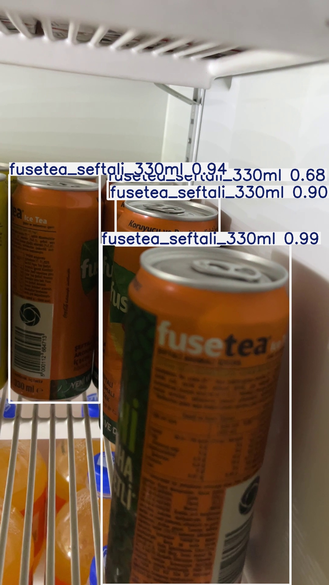
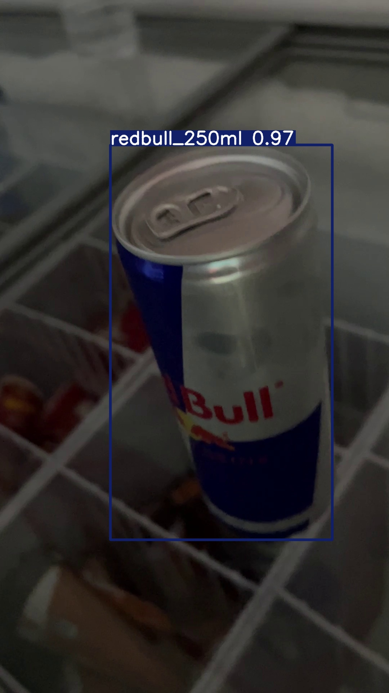

# DolapAnaliz

Soğutucu dolap/raf içeriğini fotoğraf üzerinden tespit eden, ürün sınıfı bazında sayan ve mobil uyumlu bir web arayüzünden test edilebilen bir bilgisayarlı görü sistemi. YOLO26 tabanlı özel eğitilmiş bir modelle çalışır.

## Genel Bakış

Kullanıcı dolabın fotoğrafını çeker (telefon veya bilgisayar üzerinden) → model ürünleri tespit edip sınıf bazında sayar → sonuç, tespit kutuları çizilmiş görsel ve ürün adedi olarak anında gösterilir.

## Örnek Analiz

Model, fotoğraftaki her ürünü sınıfıyla ve güven skoruyla birlikte kutulayıp sınıf bazında sayıyor.

| | |
|---|---|
|  |  |
| Dolap içindeki 4 adet Fuse Tea Şeftali, farklı açı/kısmi görünürlüklere rağmen ayrı ayrı tespit edilip güven skorlarıyla (0.68–0.99) işaretlenmiş. | Dolap rafındaki tek bir Red Bull, %97 güven skoruyla net şekilde tespit edilmiş. |


## Özellikler

- 📷 **Fotoğraf tabanlı tespit ve sayım** — mobil uyumlu web arayüzü üzerinden telefon kamerasıyla veya galeriden fotoğraf yükleyerek anlık analiz
- 🎥 **Video tabanlı sayım (deneysel)** — ByteTrack ile takip ederek aynı ürünün birden fazla karede sayılmasını önleme; mango-ananas gibi görsel olarak benzer sınıflarda hâlâ iyileştirme aşamasında
- 🧩 **Modüler sınıf yapısı** — yeni ürünler `configs/classes.yaml` üzerinden veri toplayıp yeniden eğiterek eklenebilir
- 🔁 **Tekrarlanabilir eğitim pipeline'ı** — veri toplama → etiketleme → eğitim → değerlendirme adımlarının tamamı scriptlerle otomatikleştirilmiş

## Teknoloji Yığını

| Katman | Seçim |
|---|---|
| Dil / görüntü işleme | Python, OpenCV, Pillow |
| Nesne tespiti | YOLO26n (Ultralytics) |
| Takip (video) | ByteTrack |
| Etiketleme | Label Studio (self-hosted) |
| Eğitim ortamı | Google Colab (ücretsiz T4 GPU) |
| Web arayüzü | Flask + vanilla JS |

## Proje Yapısı

```
dolapanaliz/
├── app.py                      # Basit Gradio test arayüzü (fotoğraf, hızlı deneme)
├── mobile_app/
│   ├── server.py                # Flask sunucusu — foto + video analiz API'si
│   └── templates/index.html     # Mobil uyumlu arayüz
├── scripts/
│   ├── collect_frames.py        # Videodan eğitim karesi çıkarma
│   ├── split_dataset.py         # train/val veri seti bölme
│   ├── link_dataset_images.py   # Label Studio export'unu görsellerle eşleştirme
│   ├── detect_and_count.py      # Tek fotoğraf üzerinde CLI testi
│   ├── count_from_video.py      # Video üzerinde takip tabanlı sayım (CLI)
│   └── download_external_dataset.py
├── configs/
│   ├── classes.yaml              # Sınıf tanımları (tek doğruluk kaynağı)
│   ├── data.yaml                 # YOLO eğitim veri seti tanımı
│   └── tracker_custom.yaml       # Özelleştirilmiş ByteTrack ayarları
├── models/v1/best.pt             # Eğitilmiş model ağırlıkları
├── data/                         # Ham video/görsel veri (repoya dahil değil, bkz. .gitignore)
└── requirements.txt
```

## Kurulum

```bash
pip install -r requirements.txt
```

## Kullanım

### Mobil Web Arayüzü (Önerilen)

```bash
python mobile_app/server.py
```

Aynı WiFi ağındaki bir telefondan `http://<bilgisayar-yerel-IP>:5000` adresine gidin. Fotoğraf çekin/seçin, model anında ürünleri tespit edip sayar.

### Komut Satırından Tek Fotoğraf Testi

```bash
python scripts/detect_and_count.py --model models/v1/best.pt --source foto.jpg
```

### Video Analizi (Deneysel)

```bash
python scripts/count_from_video.py --model models/v1/best.pt --source video.mp4
```

## Mevcut Ürün Sınıfları (Faz 1)

`configs/classes.yaml` içinde tanımlı, gerçekten veri toplanıp eğitilen 5 sınıf:

- Kutu Kola 250ml
- Fuse Tea Mango Ananas 330ml
- Fuse Tea Şeftali 330ml
- Fuse Tea Limon 330ml
- Red Bull 250ml

Model performansı ve eğitim süreci detayları için bkz. aşağıdaki **Metodoloji** bölümü.

Ek sınıflar (Kola/Fanta/Sprite/cam şişe varyantları, Kola Zero, Beypazarı Soda) `classes.yaml` içinde "Faz 2 / planlanan" olarak tanımlı — veri toplandıkça eklenecek. Yeni sınıf eklemek kod değişikliği gerektirmez: veri topla → etiketle → yeniden eğit.

## Metodoloji

Veri setinin tamamı sıfırdan, elle toplanıp etiketlendi — hazır/genel bir veri seti kullanılmadı (bkz. aşağıdaki "İlk Sürüm Notu"). Süreç dört aşamadan oluşuyor:

### 1. Veri Toplama

Her ürün için telefon kamerasıyla iki tür video çekildi: (a) ürünün 360° etrafında gezdirilerek çekildiği ~10 saniyelik yakın çekim, (b) birden fazla ürünün aynı karede, dolap içinde bir arada göründüğü ~3-4 saniyelik toplu çekim. Videolar `data/raw_videos/<ürün>/` altında sınıf bazında klasörlendi.

Videolar, `scripts/collect_frames.py` scripti ile (Python + OpenCV — `cv2.VideoCapture` / `cv2.imwrite`) fotoğraf karelerine dönüştürüldü. Her 0.3 saniyede bir kare örneklendi; bu sayede art arda neredeyse birebir aynı olan kareler elenip, videonun süresine oranla çeşitliliği yüksek bir görsel kümesi elde edildi.

| Sınıf | Çıkarılan Kare Sayısı |
|---|---:|
| Kutu Kola 250ml | 66 |
| Fuse Tea Mango Ananas 330ml | 45 |
| Fuse Tea Şeftali 330ml | 88 |
| Fuse Tea Limon 330ml | 75 |
| Red Bull 250ml | 76 |
| **Toplam** | **350** |

### 2. Etiketleme

Çıkarılan kareler, **Label Studio** (self-hosted, yerel olarak çalıştırılan açık kaynak bir etiketleme aracı) ile elle etiketlendi. Veri hiçbir zaman üçüncü bir buluta gönderilmedi. Her fotoğrafta ürünlerin etrafına bounding box çizilip doğru sınıf atandı; birden fazla ürün içeren karelerde her ürün ayrı ayrı işaretlendi. Kısmen kapanan (occluded) ürünlerde kural sabitti: kutu, yalnızca **görünen** kısmı sarmalayacak şekilde çizildi, kapalı alan tahmin edilerek kutuya dahil edilmedi.

350 karenin 295'i etiketlenip onaylandı; kalan ~55 kare (neredeyse birebir tekrar eden veya bulanık kareler) veri kalitesini düşürmemek için bilinçli olarak dışarıda bırakıldı.

### 3. Veri Setinin Bölünmesi (Train / Validation)

Etiketlenen 295 görsel, `scripts/split_dataset.py` ile **%85 eğitim (train) – %15 doğrulama (validation)** oranında rastgele (sabit seed ile tekrarlanabilir şekilde) ikiye ayrıldı:

- **Eğitim seti:** 251 görsel
- **Doğrulama seti:** 44 görsel

Doğrulama seti, eğitim sırasında modele hiç gösterilmedi — yalnızca "model gerçekten öğrendi mi, yoksa ezberledi mi" sorusunu ölçmek için kullanıldı.

### 4. Model Eğitimi

**YOLO26n** (Ultralytics), COCO üzerinde önceden eğitilmiş ağırlıklardan başlanarak Google Colab'ın ücretsiz T4 GPU'sunda fine-tune edildi (transfer learning). Eğitim, 100 epoch üst sınırıyla başlatıldı; 20 epoch boyunca gelişme kaydedilmeyince erken durdurma (early stopping) devreye girip **67. epoch'ta** en iyi ağırlıklarla (47. epoch checkpoint'i) sonlandı.

Doğrulama seti üzerindeki sonuçlar:

| Sınıf | Val Görsel | Val Örnek | mAP50 |
|---|---:|---:|---:|
| Fuse Tea Limon 330ml | 7 | 7 | 0.995 |
| Kutu Kola 250ml | 6 | 6 | 0.995 |
| Fuse Tea Şeftali 330ml | 15 | 31 | 0.906 |
| Fuse Tea Mango Ananas 330ml | 4 | 9 | 0.913 |
| Red Bull 250ml | 12 | 15 | 0.640 |
| **Genel** | **44** | **68** | **0.890** |

Genel Precision = 0.91, Recall = 0.80.

### İlk Sürüm Notu (v1)

Bu, projenin **ilk fine-tuning denemesi** — yaklaşık 250 eğitim görseliyle eğitilmiş bir pilot model. Tablodan da görüleceği gibi bazı sınıflar (özellikle **Red Bull** ve **Fuse Tea Mango Ananas**) diğerlerine göre daha zayıf performans gösteriyor; bunun başlıca sebebi bu sınıflar için toplanan veri miktarının azlığı (Mango Ananas için sadece 45 ham kare, diğerlerinde 66-88 arası).

Sistem, veri setini `v1`, `v2` gibi versiyonlayarak sürekli büyütülüp modelin periyodik olarak yeniden eğitilmesi üzerine tasarlandı — tek seferlik bir eğitim değil, veri arttıkça doğruluğu artan, sürdürülebilir bir süreç hedefleniyor. Zayıf sınıflar için ek veri toplanması ve modelin yeniden eğitilmesi, yol haritasının önceliklerinden biri.

## Yol Haritası

- [x] Veri toplama ve ön işleme
- [x] Etiketleme (Label Studio)
- [x] Model eğitimi (YOLO26n fine-tuning)
- [x] Fotoğraf tabanlı mobil web arayüzü
- [ ] Video/takip tabanlı sayımın stabilizasyonu
- [ ] Stok eşiği ve düşük stok uyarı mantığı
- [ ] Native mobil uygulama (React Native/Flutter)
- [ ] Faz 2 sınıflarının eklenmesi

## Lisans Notu

YOLO26/Ultralytics AGPL-3.0 ile ücretsiz — kişisel/araştırma/iç kullanım için uygundur. Ticari/kapalı kaynak dağıtım için Ultralytics Enterprise lisansı ya da Apache-2.0 lisanslı bir alternatif gerekebilir.
